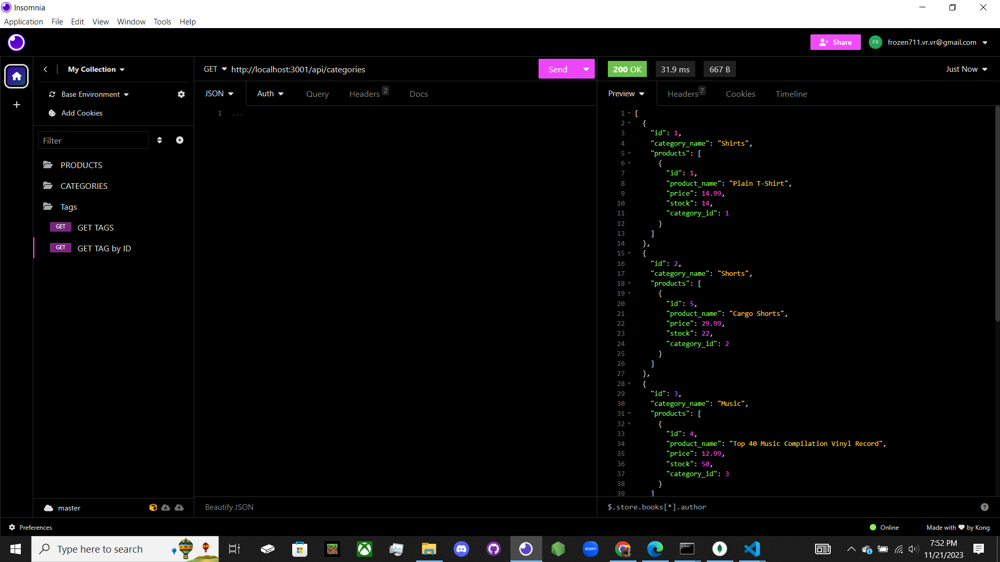

# Emazon_eCommerce
e-commerce website that uses the latest technologies using back end and Insomnia.
  ## Description
  ```md
GIVEN a functional Express.js API
WHEN I add my database name, MySQL username, and MySQL password to an environment variable file
THEN I am able to connect to a database using Sequelize
WHEN I enter schema and seed commands
THEN a development database is created and is seeded with test data
WHEN I enter the command to invoke the application
THEN my server is started and the Sequelize models are synced to the MySQL database
WHEN I open API GET routes in Insomnia for categories, products, or tags
THEN the data for each of these routes is displayed in a formatted JSON
WHEN I test API POST, PUT, and DELETE routes in Insomnia
THEN I am able to successfully create, update, and delete data in my database
```
  ## Table Of Contents
  - [Installation](#installation)
  - [Usage](#usage)
  - [Contributing](#contributing)
  - [Tests](#tests)
  - [Questions](#questions)
  ## Installation
  The following necessary dependencies must be installed to run the application, dotenv, express, mysql2, nodemon, and sequelize
  ## Usage
  In order to use this app, open an integrated terminal, npm install, node seeds/index.js, and npm start. You will then use Insomnia. Just like in the screen shot.
  ## License
  
  This project is licensed under the The MIT License license.
  This project is licensed under the [](https://opensource.org/licenses/MIT).
  The license link can be found here https://opensource.org/licenses/MIT.
  ## Contributing
  Contributors: Victor Romero-Beltran
  ## Tests
  The following is needed in order to run the test: N/A 
  ## Questions
  If you have any other questions about this project, please contact me directly at vromero.beltran2016@gmail.com or through GitHub at https://github.com/vromero-beltran.